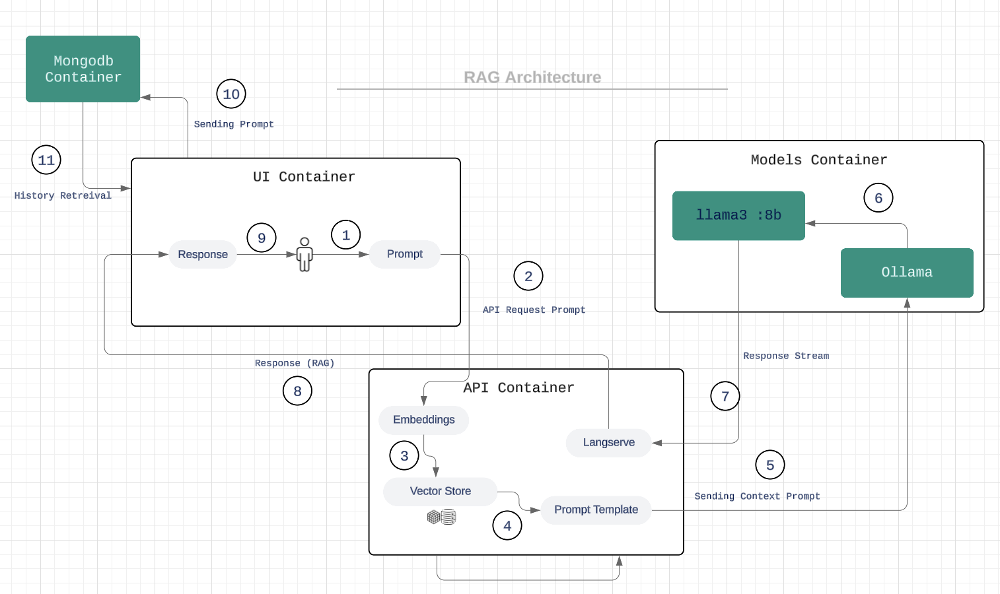
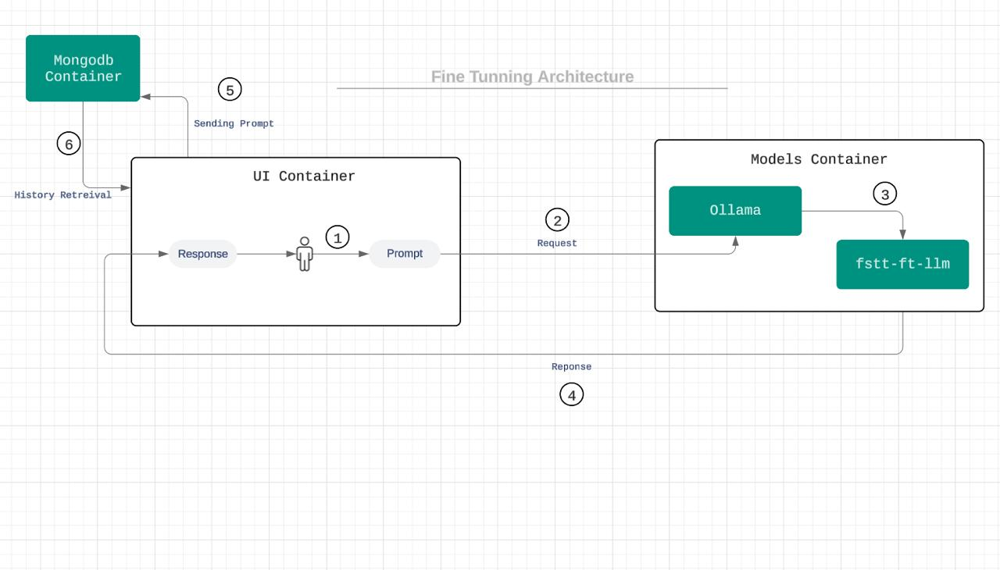

# FSTT-LLM-Chat-Bot

A chat bot for the Faculty of Sciences and Technologies of Tangier. Two models are available. The first is a fine-tuned Llama3-8B- instruct on public information from the faculty's website, and a second is for RAG implementation, which uses [Solon-embeddings-large-0.1](https://huggingface.co/OrdalieTech/Solon-embeddings-large-0.1) for embeddings and Llama3-8B for inference. The RAG is done on a large dataset of the faculty's MIPC program, which includes pdf courses, exams, exercises, and other resources.

> [!WARNING]  
> If you want to run the project on docker, know that the containers will take up to 50GB of disk space in total.

## Getting started

1. **Go to the source directory**: Make sure you have the necessary storage requirements.

2. **Install and open MongoDB**: Create a database named `chat-ui` and a collection with the same name.

3. **Download the model**: 
   - Download the model from this [link](https://huggingface.co/aL0NEW0LF/unsloth-llama-3-q4_k_m).
   - Place the downloaded model in the base folder.
4. **Download Embeddings dataset**:
    - Download the embeddings dataset from this [link](https://huggingface.co/datasets/aL0NEW0LF/fstt-educational-content-embeddings).
    - Place the downloaded embeddings dataset in `apps\api\app\rag_chroma`.
5. **Start the project**:
   - Open a terminal in the base directory.
   - Run the following command to start the project:
     ```bash
     docker-compose -f docker-compose.yml up -d
     ```
6. **Access the project**:
   - Open your web browser and go to `localhost:3000`.

Your project should now be up and running!

## Introduction
Artificial intelligence has shown extremely rapid development over the past ten years, transforming most industries. The most striking and impactful application is natural language processing, which allows machines to process, understand, and generate human language, thus enabling a more natural and seamless interaction between humans and computers. One of the most significant recent developments in this domain is the creation of so-called chatbots, which are capable of deep comprehension and generation of human-like text in their conversations. Such a development enables the wider adoption of chatbots in applications like customer service and technical support, as well as applications for personal use, like personal assistants and educational tools.
This project will focus on the design and development of a sophisticated chatbot build on a fine-tuned large language model (Llama3) on a specific context related to the Faculty of sciences and technologies of Tangier, as well as using RAG methods to extend its knowledge, with a large dataset of courses and related stuff. Fine-tuning the chatbot to adapt to the FSTT's academic environment and content will deliver a more relevant and appropriate response to the educational environment and better the experience for both students and faculty. Deployment of chatbots within an educational setting offers numerous benefits. Chatbots can provide instant answers to questions for students, support in administrative tasks, language learning, and personalized tutoring. However, to achieve these benefits, it is essential that the chatbot is well fitted into the specific academic environment within which it will be put to use. This can be done by fine-tuning the chatbot on a specialized corpus that reflects the linguistic and thematic nuances of the educational materials and activities at FSTT.
## Objectives
This project tries to create an intelligent and contextually aware chatbot using RAG and fine-tuning. The chatbot will be fine-tuned using a specialised French corpus and general information data collected from the faculty's website. RAG, on the other hand, is a hybrid approach that combines retrieval and generation-based techniques to produce more precise and contextually appropriate results. LangChain is a framework for seamlessly integrating and managing numerous language models when developing complicated NLP applications. Vector databases are utilised for efficient big data storage and retrieval, which is essential for managing massive amounts of training and operational data.
By using these technologies, the chatbot will respond accurately and contextually appropriately to a wide spectrum of requests regarding the academic environment at FSTT. It will considerably improve the end-user experience, making the chatbot a very useful tool, especially for new students and faculty members.
## Motivations
Fine-tuning becomes one of the project's most important approaches since it is the act of deeply adapting pre-trained language models to the specifics of specialised domains or jobs. Unlike generic language models, fine-tuned models are modified in such a way that they are almost identical to the target domain's linguistic intricacies, terminologies, and contextual unique characteristics. In the context of Tangier's Faculty of Sciences and Techniques (FSTT), where such academic discourse encompasses a wide range of subjects and disciplines, fine-tuning is essential.
Due to an intense fine-tuning process of language models against this custom corpus harvested from the FSTT academic material, the chatbot develops exceptional proficiency in understanding and generating the kind of text demanded in the academic landscape of the specific institution. By undergoing this kind of granular customization, the chatbot is endowed with the ability not only to understand the underlying semantics of queries but also to respond in a manner that is more precise and relevant than off-the-shelf solutions can afford. This guarantees that the students, faculty, and staff using the chatbot will have a frictionless, engaging exchange with the chatbot, allowing them to proceed with a nuanced understanding and contextually relevant response.
First, fine-tuning facilitates a symbiotic relationship between the language model and the domain experts involved in the project. Through a loop of iterative refinement, FSTT stakeholders can actively shape and enhance the chatbot's capabilities, ensuring that it remains attuned to evolving academic needs and preferences. This collective enterprise not only enhances the chatbot's effectiveness but also inculcates a sense of ownership and investment among the FSTT community, engendering trust and engagement with the AI-driven tool.
In essence, then, fine-tuning becomes a strategic enabler for the chatbot project, allowing it to transcend the limitations of generic language processing solutions and become a truly bespoke, contextually aware assistant, attuned specifically to the academic domain of FSTT.
## Data Collection
The data collection process is a crucial step in this project, forming the foundation for fine-tuning the chatbot. This involves gathering relevant academic materials and information from two primary sources: the website of the Faculty of Sciences and Techniques of Tangier (FSTT) and various PDF documents provided by the professors. The data will be processed and organized to facilitate the fine-tuning of the language models and the implementation of Retrieval-Augmented Generation (RAG). 
* DEUST, Licence, Master, Engineer Cycle: Information regarding different academic programs offered at FSTT. News: Updates and announcements related to academic and extracurricular activities.
* Clubs: Details about student clubs and organizations within the faculty.
* Coordinators: Information about academic coordinators and their roles.
* Departments: Details of the various academic departments within FSTT.
* Important Links: Key links to resources and external websites relevant to the students and faculty. Information about the Faculty: General information about FSTT, including its history, mission, and vision.
The process of scraping the website involved the following steps:
1.  Accessing the Website: We accessed the FSTT website at https://fstt.ac.ma/Portail2023/.
2.  Parsing HTML Content: Using Beautiful Soup, we parsed the HTML content of the website pages.
3.  Extracting Relevant Data: Specific sections of the HTML were targeted to extract the required information.
4.  Structuring the Data: The extracted data was then organized into a structured format, primarily JSON.
5.  Generated from this latter another JSON file that comprises two main components: instructions (questions or prompts) and responses (answers or information related to the prompts). The JSON structure allows for efficient storage and retrieval of data, making it easier to use for training and fine-tuning the language models.
6.  Data from PDFs: In addition to web data, we collected PDF documents from professors at FSTT. These documents include:
	1. Course Materials: Lecture notes, syllabi, and other teaching materials.
	2.  Practical Works (TP): Instructions and guidelines for practical sessions.
	3. Tutorials (TD): Problem sets and exercises for tutorial sessions.
	4. Projects: Documentation and guidelines for academic projects.
## Retrieval-Augmented Generation (RAG)
To enhance the chatbot's ability to provide accurate and contextually relevant responses, we employed Retrieval-Augmented Generation (RAG). RAG combines the strengths of retrieval-based and generation-based approaches, enabling the chatbot to fetch relevant information from a large corpus and generate coherent and contextually appropriate responses.
#### Populating the database
Our Corpus contains nearly everything related to the DEUST MIPC, Licence Génie Informatique, Master IASD (S1 and S2), including courses, exercises, projects and many more, the total size of data is nearly 1.01GB of PDFs, MS Word, and MS PowerPoint documents.
In order to create embeddings for this large dataset we used a model called  "OrdalieTech/Solon-embeddings-large-0.1" from HuggingFace which ranks 4th on the MTEB leaderboard for french language retrieval, this choice was made because first, text embeddings play a huge role in retrieving relevant context to the query, and second because the other three models are paid or they require some kind of paid API Access. there are other parameters which we should mention such as chunk size which we set equal to 800, this parameter controls the size of the chunk taken from a document, and chunk overlap is set to zero, to make sure that our chunks don't overlap since we need accurate embeddings. After generating said Embeddings they are stored in a ChromaDB database fro later retrieval tasks.
#### Retrieval Mechanism and Inference
When a query is received, the vector store retrieves the most relevant documents or text snippets from the indexed corpus, after much experimentation we've concluded that a good number for top-K documents is 7, since lower that 7 is too little context for large document, and choosing a bigger number make the LLM confused and not sure which information in context to use for inference.
The retrieved context is then passed to Llama3-8B for inference and generating response.
## Fine-Tuning
Fine-tuning involved adapting pre-trained language models to understand and generate text specific to the academic context of FSTT. This process included several critical steps to ensure the chatbot's effectiveness and relevance:
1.  **Scraping Data**: This step involved scraping data from the faculty web site to have all the general information needed for the LLM to learn.
2. **Formatting Data**: Once we had our desired data,  we ended up with a heavily nested JSON file which an LLM can't use for its learning, so we had to format it into multiple formats including plane text, markdown, and a JSON file of of instructions and responses, this simplifies our data format for further use by the LLM.
3. **Model Selection**: Choosing a model depends on multiple factors, including our needs, the computational resources available, and the desired performance. We selected the Llama 3 8B instruct model for its small size compared to the 70b model, and its great performance in the academic and educational context.
4. **Preparing data for training**To train the model on our instructions and responses, we had to format each row into a text with a system prompt ate the top, we also added the raw markdown text to the dataset to help the model understand the context of the text.
5. **Training**: The training was done using the unsloth library, which automates the training process, makes it easier to fine-tune the model, and provides an even lighter and faster version of our chosen model. Due to the small size of our dataset and the limited computational resources, we opted for the Low-Rank Adaptation (LoRA) method, which is a more efficient way to fine-tune the model, reducing the number of parameters to be trained and memory usage.
Through this fine-tuning process, the chatbot developed a decent understanding of the academic content specific to FSTT, enabling it to provide accurate and contextually appropriate responses to users' queries.
## Tools and Technologies
In order to create a smart chatbot for the Faculty of Sciences and Techniques of Tangier (FSTT), we used a wide range of tools and technologies in this project. From data collection and model optimisation to deployment and user engagement, every tool was essential to the project at different points.
* **Hugging Face**: Hugging Face provided a comprehensive library of pre-trained models and tools for natural language processing.
* **Pytorch**: PyTorch was the deep learning framework used for training and fine-tuning the models. It provided:
	* Flexible Framework: Enabling complex model architectures and custom training loops.
	* Community Support: Leveraging a wide range of tutorials and pre-existing codebases.
* **Llama 3 8B: Instruct**: An instruct fine-tuned version of the 8B model that is optimized for specific tasks. For instance, it can be used to create educational tools that explain complex subjects. It provided:
	* High Accuracy: Leveraging its large parameter size for nuanced understanding.
	* Contextual Relevance: Generating contextually appropriate responses for academic queries.
* **Kaggle and Google Colab**: Kaggle and Google Colab were utilized for their GPU resources to speed up the training and fine-tuning processes. They provided:
	* GPU Access: Leveraging powerful GPUs for faster computation.
	* Collaborative Environment: Facilitating code sharing and collaboration.
* **Unsloth**: Unsloth was used for automating various aspects of the development workflow, including data preprocessing and model training. It helped in:
	* Automation: Reducing manual effort in repetitive tasks.
	* Efficiency: Streamlining the development process.
* **Langserve**: Langserve is a language model serving tool that was used to deploy the fine-tuned models efficiently. It helped in:
	* Serving Models: Providing an interface for querying the fine-tuned models.
	* Scaling: Managing multiple instances to handle concurrent requests.
* **Ollama**: Ollama was used for managing and optimizing language models. It played a role in:
	* Model Optimization: Fine-tuning model parameters for better performance.
	* Resource Management: Efficiently utilizing computational resources during training and inference.
* **SvelteKit**: SvelteKit was used for developing the front-end interface of the chatbot. It offered:
	* Interactive UI: Creating a responsive and user-friendly interface.
	* Single Page Application: Ensuring smooth navigation and fast load times.
* **Chroma DB (Vector Database)**: Chroma DB served as the vector database for storing and retrieving large volumes of academic text. It facilitated:
	* Efficient Indexing: Storing text in a format suitable for fast retrieval.
	* Similarity Searches: Enabling the retrieval of contextually relevant information.
* **Docker**: Docker was used to containerize the application, ensuring consistent environments across different stages of development, testing, and deployment. It facilitated:
	* Environment Consistency: Ensuring that the application runs identically on different machines.
	* Scalability: Simplifying the scaling process for handling more users.
## Architectures

Our chatbot project leverages two distinct architectures: one for Retrieval-Augmented Generation (RAG) and another for fine-tuning. We'll delve into the RAG architecture first.
#### The RAG Architecture: A Multi-Container System


The RAG architecture utilizes a meticulously designed system comprised of three Docker containers, each playing a crucial role in the chatbot's workflow:
1.  **User Interface (UI) Container:** This container serves as the entry point for user interaction. Users initiate the process by entering their query (prompt) through this interface.
2.  **API Container:** Upon receiving the user's prompt from the UI container, the API container initiates an API request. This request encapsulates the user's prompt and facilitates its transmission to the subsequent stages within the architecture.
    - **Embedding and Vector Store:** Within the API container, the user's prompt undergoes an "embedding" process. This sophisticated technique transforms the prompt into a numerical representation that allows for efficient similarity comparisons within the vector store (ChromaDB).
    - **Prompt Template Generation:** Following the embedding process, the API container generates a refined "prompt template" based on the embedded representation. This refined template further enhances the accuracy of information retrieval.
3. **Model Container:** This container houses the core computational power of the RAG system.
    - **Ollama:** This component plays a vital role in managing and optimizing the language model (Llama3) utilized within the system.
    - **Llama3:** This state-of-the-art large language model, receives the context-rich prompt template from the Ollama server. It then utilizes its deep understanding of the domain to generate a response that is both linguistically accurate and relevant to the user's query and according to the retrieved context.
3. **API Response and Storage:**
    - **LangServe:** The LangServe component serves as API endpoint build on top of FastAPI for retrieving responses from the Llama3 model.
    - **API Response:** Within the API container, LangServe presents the retrieved response as output for the user. This response is displayed on the user interface, providing them with the information they sought.
This multi-container approach ensures a modular and efficient workflow within the RAG architecture. It empowers the chatbot to effectively leverage its knowledge base and deliver insightful responses to user queries.
#### Fine-Tuning Architecture: Tailored Response Generation

The fine-tuning architecture employs a streamlined containerized approach, akin to the RAG architecture. It leverages two primary containers to deliver contextually relevant responses:
1. **User Interface (UI) Container:** This container serves as the initial point of user interaction, mirroring the RAG architecture. Users initiate the process by entering their query (prompt) through this interface.
2.  **Fine-Tuning Container:** This container houses the core functionalities of the fine-tuning process, similar to the Model Container in the RAG architecture.
3. **Ollama:** Replicating its function within the RAG architecture, Ollama manages and optimizes the fine-tuned language model (fstt-ft-llm) utilized within this system.
4. **fstt-ft-llm:** This component represents the heart of the fine-tuning architecture, analogous to Llama3 in the RAG system. Pre-trained on a general French corpus, it undergoes further fine-tuning using the specialized academic content specific to FSTT. This rigorous fine-tuning process empowers the model to develop a deep understanding of the academic domain, enabling it to generate highly relevant and accurate responses to user queries.
**Response Presentation and Storage:** This section mirrors its counterpart in the RAG architecture description:
* **User Response:** Once the fstt-ft-llm processes the user's prompt, it generates a response tailored to the specific query and the academic context of FSTT. This response is then presented to the user through the UI container.
This streamlined containerized approach ensures efficient fine-tuned response generation, allowing the chatbot to leverage its specialized knowledge and deliver informative answers targeted towards the FSTT academic environment.
## Conclusion
In conclusion, the creation of this chatbot involved the utilization of two main techniques: retrieval-augmented generation (RAG) and fine-tuning. The RAG technique is employed to extract information from PDF files, such as course materials or descriptions. This is achieved by using an embedding model, referred to as "Solon-embeddings-large-0.1", which transforms the extracted information into a format that can be processed. When a user poses a question, the context is derived from these embeddings and fed into the Lama3 model, which has 8 billion parameters, to generate a response.\
For the second part of the process, the LoRa architecture is utilized to fine-tune the Lama3 model. This allows for the model's weights to be frozen, meaning they remain unchanged, while the model is trained on data that has been scraped from the faculty's resources. By doing so, the model can be customized to better suit the specific data and likely queries it will encounter.\
In the final stage, both models are integrated into a single interface. This provides users with the flexibility to choose between the two models based on their preferences or needs. Such an interface enhances the user experience by offering a tailored interaction, whether they require detailed information retrieval or more nuanced conversational engagement. The end result is a sophisticated chatbot capable of handling a variety of tasks, from answering straightforward questions to providing in-depth explanations, all while maintaining a user-friendly approach.